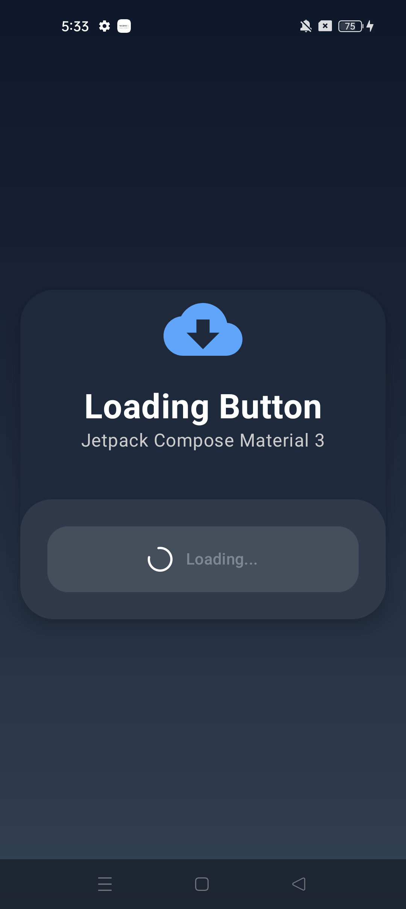
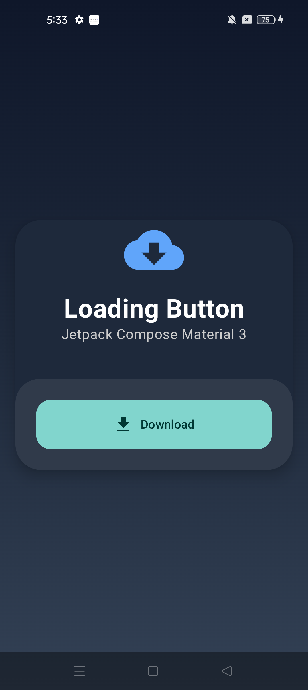
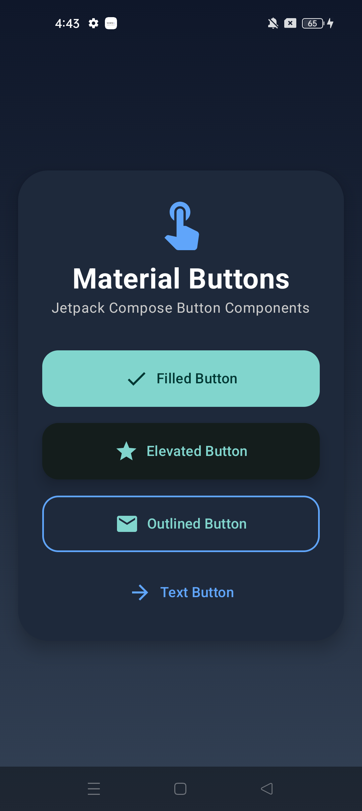
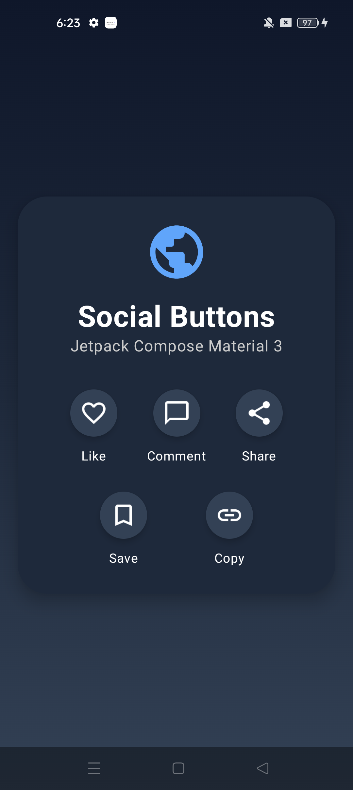
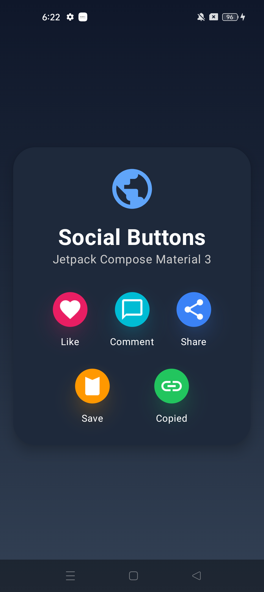
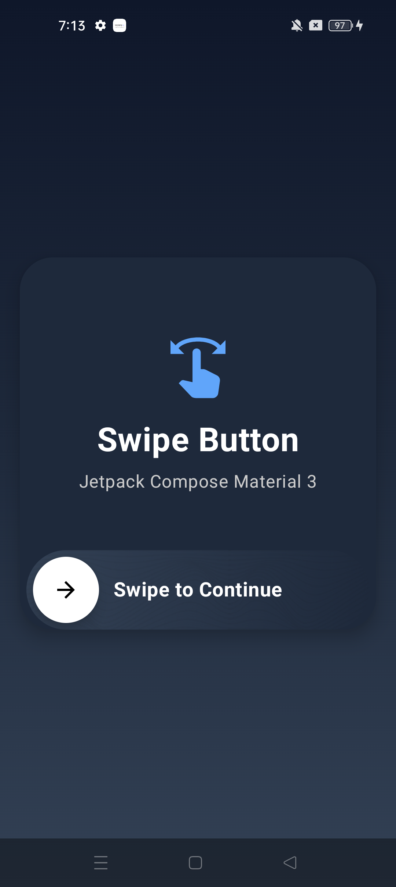
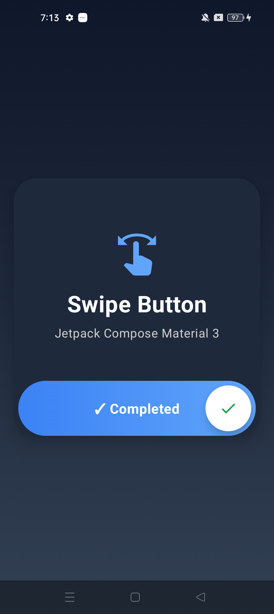

# Button Components

A collection of modern, reusable, and animated **Button UI Components** built with **Kotlin and Jetpack Compose**.

These components are designed for modern Android applications and can be easily customized and reused in different projects.

---

## Components

### 1. Gradient Icon Button

A modern gradient-style button with an icon, designed for attractive Android interfaces.

  

**Source Code:**  
[`Gradient_icon_Button.kt`](./Gradient_icon_Button.kt)

---

### 2. Loading Button

A button with loading and download states, useful for actions that require processing or network operations.

  
  

**Source Code:**  
[`Loading_Button.kt`](./Loading_Button.kt)

---

### 3. Material Button

A clean Material-style button component for Jetpack Compose applications.

  

**Source Code:**  
[`Material_Button.kt`](./Material_Button.kt)

---

### 4. Social Action Button

A reusable social action button with different visual styles and color variations.

  
  

**Source Code:**  
[`SocialAction_Button.kt`](./SocialAction_Button.kt)

---

### 5. Swipe Button

An interactive swipe-to-complete button for actions that require user confirmation.

  
  

**Source Code:**  
[`Swipe_Button.kt`](./Swipe_Button.kt)

---

## Built With

- **Kotlin**
- **Jetpack Compose**
- **Material 3**
- **Android**

---

## Features

- Modern button designs
- Reusable Compose components
- Animated interactions
- Loading states
- Swipe-to-action functionality
- Gradient UI
- Social action buttons
- Material 3 design
- Easy customization
- Ready to use in Android projects

---

## How to Use

1. Open the required button component.
2. Copy the Kotlin code.
3. Add the required imports.
4. Paste the component into your Jetpack Compose project.
5. Customize colors, icons, shapes, animations, and dimensions as needed.

---

## Preview

  
  
  
  
  

---

## YouTube Tutorials

Learn how to build these modern Jetpack Compose button components step by step.

🎥 **[Watch the Complete Button Component Series](https://www.youtube.com/playlist?list=PLbpzWxZUs-xE)**

The tutorials explain how to build each component from scratch using Kotlin and Jetpack Compose.

---

## License

You are free to use, modify, and integrate these components into your own Android projects.
