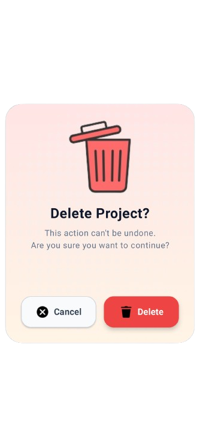
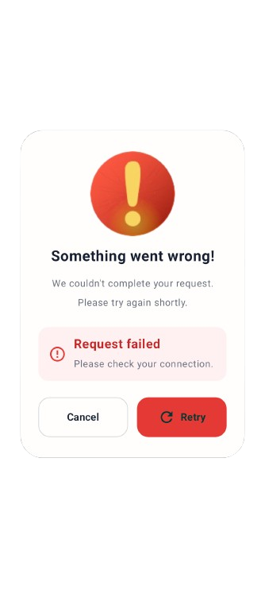

# Dialog Components

Modern Dialog UI components built with Kotlin, Jetpack Compose, and Material 3.

## Preview

### Confirmation Dialog

### Error Dialog

### Success Dialog

### Rating Dialog

### Delete Account Dialog

 
## Components

- Confirmation Dialog
- Error Dialog
- Success Dialog
- Rating Dialog
- Delete Account Dialog
## Built With

- Kotlin
- Jetpack Compose
- Material 3

## Source Code

- [Confirmation Dialog](./Confirmation_Dialog.kt)
- [Error Dialog](./Error_Dialog.kt)
- [Success Dialog](./Success_Dialog.kt)
- [Rating Dialog](./Rating_Dialog.kt)
- [Delete Account Dialog](./DeleteAccount_Dialog.kt)
## YouTube Tutorial

Watch the complete tutorial on YouTube.
🎥 **[Watch the Complete Dialog Component Series](https://www.youtube.com/playlist?list=PLfTGzjVQsGbM)
