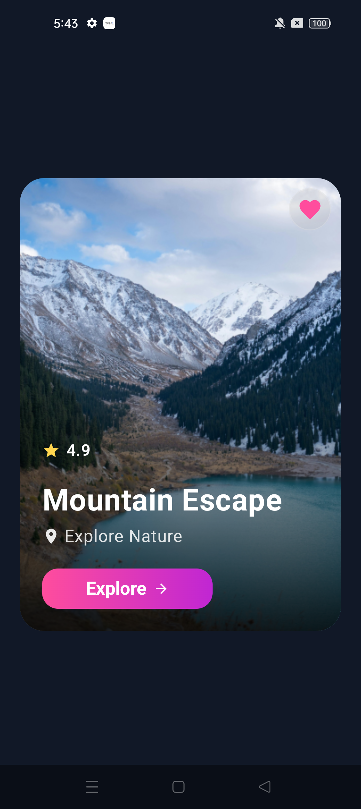
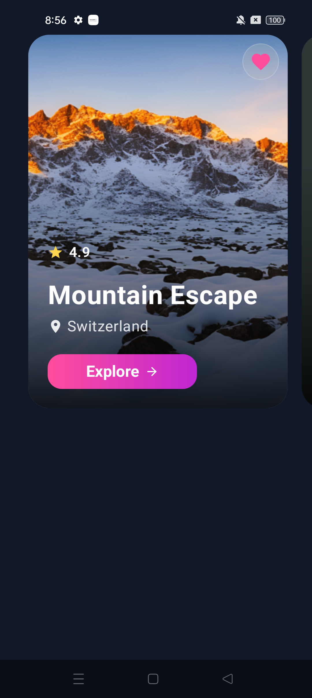
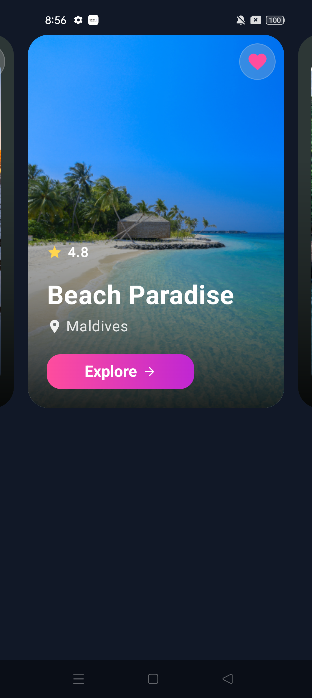
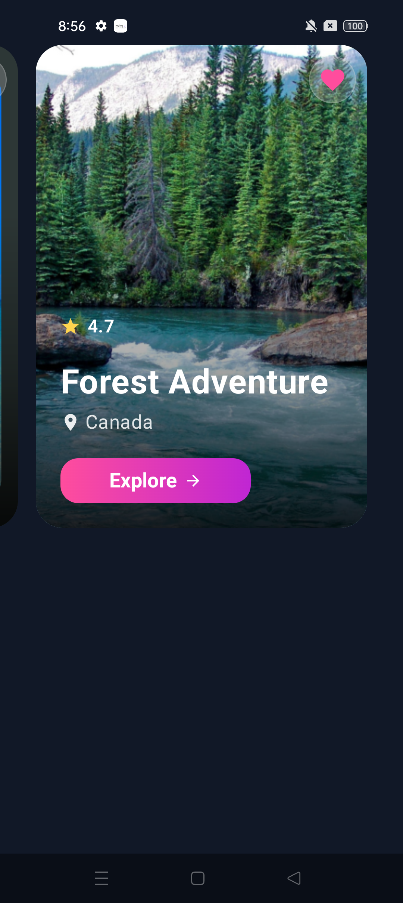
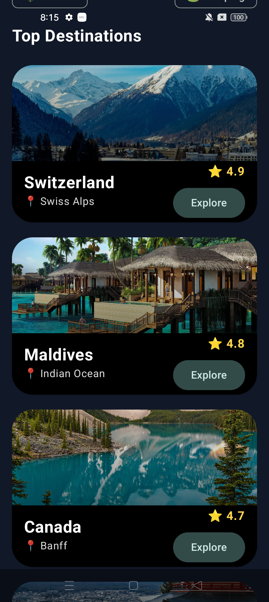

# 🖼️ Image Components – Jetpack Compose

A collection of modern and reusable **Image UI Components built with Jetpack Compose**.

This section is part of the **Jetpack Compose UI Components Series**, where each component is designed to be easy to understand, customize, and reuse in Android projects.

---

## 📱 Image Components

### 1. Circular Image

Circular profile/image component with a clean and reusable Compose implementation.

**Preview:**

**Source Code:**  
[📄 Circular_Image_Component#1.kt](./Circular_Image_Component%231.kt)

---

### 2. Gradient Overlay Image

An image component with a gradient overlay, useful for cards, banners, and image-based UI designs.

**Preview:**

**Source Code:**  
[📄 GradientOverlay_Image_Component.kt](./GradientOverlay_Image_Component.kt)

---

### 3. Image Carousel

A swipeable image carousel component for displaying multiple images.

**Preview:**

| Image 1 | Image 2 | Image 3 |
|---|---|---|
|  |  |  |

**Source Code:**  
[📄 Carousel_Image_Component.kt](./Carousel_Image_Component%23.kt)

---

### 4. Parallax Image

A modern parallax image effect created with Jetpack Compose.

**Preview:**

| Parallax Image A | Parallax Image B |
|---|---|
|  |  |

**Source Code:**  
[📄 Parallax_Image_Component#4.kt](./Parallax_Image_Component%234.kt)

---

## 🛠️ Built With

- Kotlin
- Jetpack Compose
- Material 3
- Android

---

## 📺 YouTube Tutorial Series

Watch the complete **Jetpack Compose UI Components Series** on YouTube:

👉 **[Watch the Image Components Series](https://www.youtube.com/playlist?list=PLWLdVvW1fOFk))**

New UI components and tutorials are added regularly.

