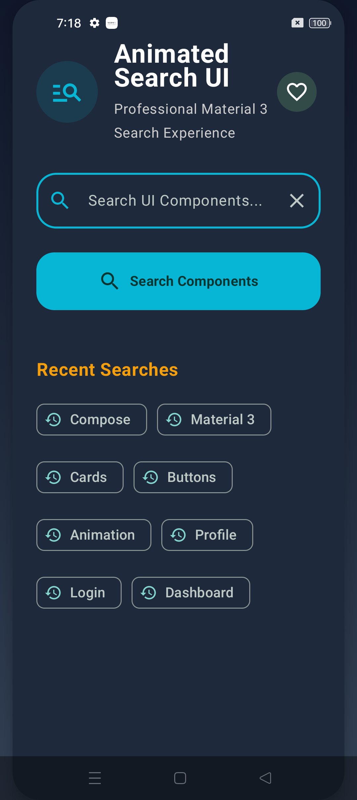
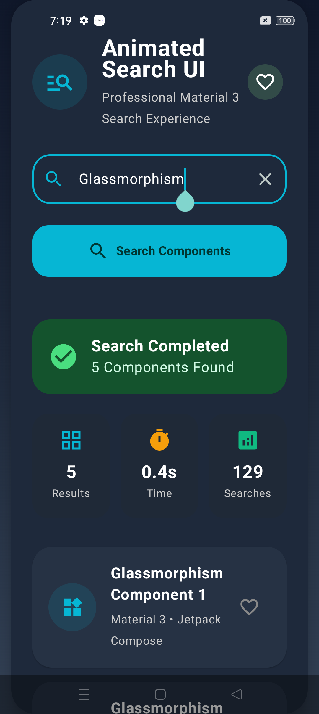
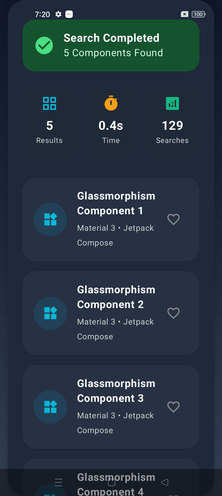
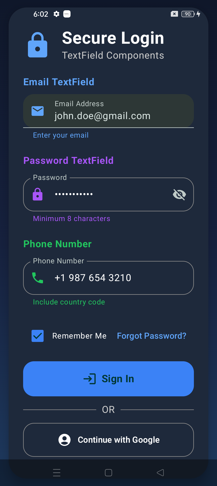
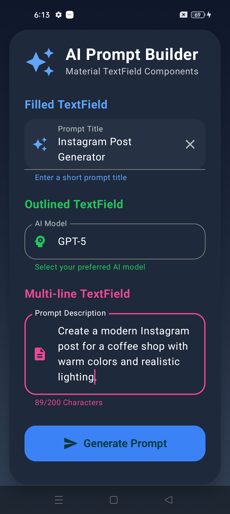
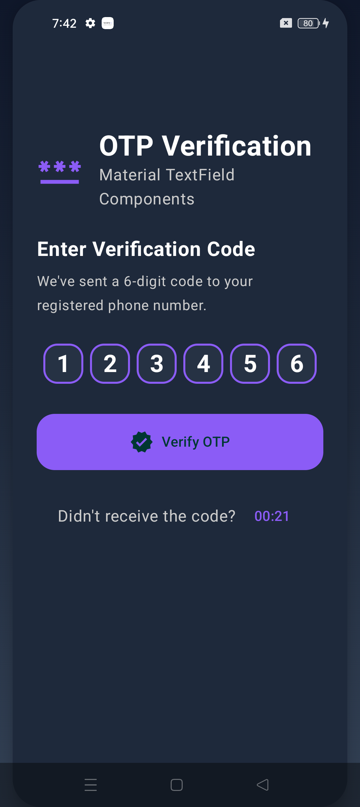
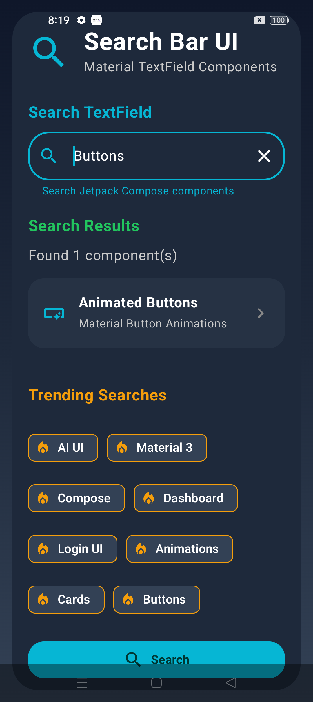

# TextField Components

A collection of modern and reusable **TextField UI components** built with **Kotlin and Jetpack Compose**.

These components are designed for Android applications and can be customized and reused in different projects.

---

## Components

### 1. Animated Search UI

A modern animated search interface with recent searches, searching state, and search results.

  
  
  

**Source Code:**  
[`Animated_SearchBar.kt`](./Animated_SearchBar.kt)

---

### 2. Login TextField

A clean and reusable TextField designed for login screens.

  

**Source Code:**  
[`Login_TextField.kt`](./Login_TextField.kt)

---

### 3. Material TextField

A modern Material TextField component designed with Jetpack Compose and Material 3.

  

**Source Code:**  
[`Material_Textfield.kt`](./Material_Textfield.kt)

---

### 4. OTP Verification UI

A modern OTP verification interface for entering verification codes.

  

**Source Code:**  
[`OTP_VerificationUI.kt`](./OTP_VerificationUI.kt)

---

### 5. Search TextField

A reusable search TextField for Android applications.

  

**Source Code:**  
[`Search_Bar_Textfield.kt`](./Search_Bar_Textfield.kt)

---

## Built With

- **Kotlin**
- **Jetpack Compose**
- **Material 3**
- **Android**

---

## Features

- Modern TextField designs
- Reusable Compose components
- Smooth animations
- Clean UI
- Material 3 design
- Easy customization
- Beginner-friendly code
- Ready to use in Android projects

---

## How to Use

1. Open the component you want to use.
2. Copy the required Kotlin code.
3. Add the required imports.
4. Paste the component into your Compose project.
5. Customize colors, typography, dimensions, and behavior as needed.

---

## Components Preview

  
  
  
  

---

## YouTube Tutorials

Step-by-step tutorials for these Jetpack Compose components are available on my YouTube channel.

The tutorials explain how to build each UI component from scratch using Kotlin and Jetpack Compose.

---

## License

You are free to use, modify, and integrate these components into your own Android projects.
